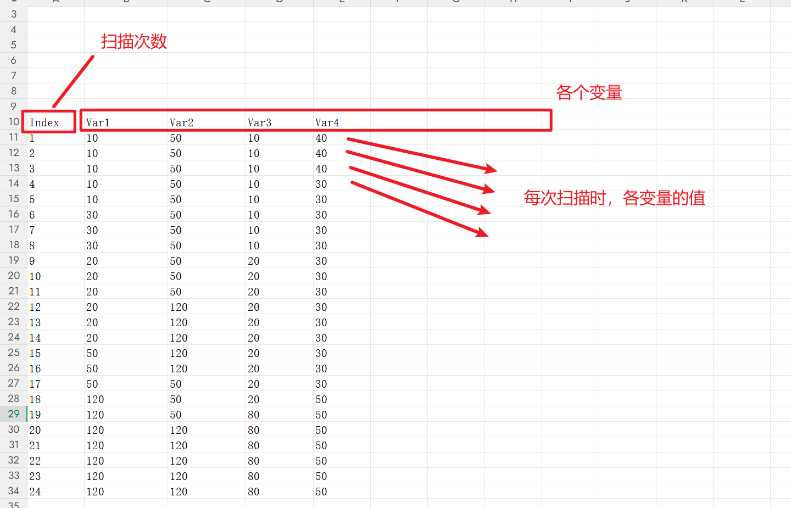
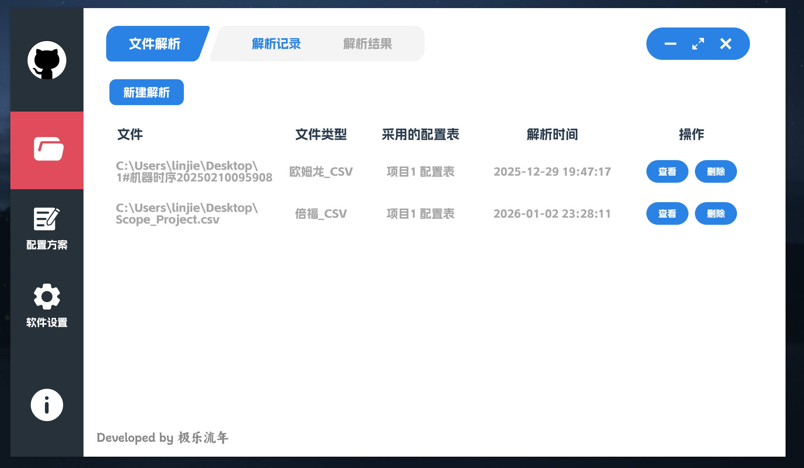
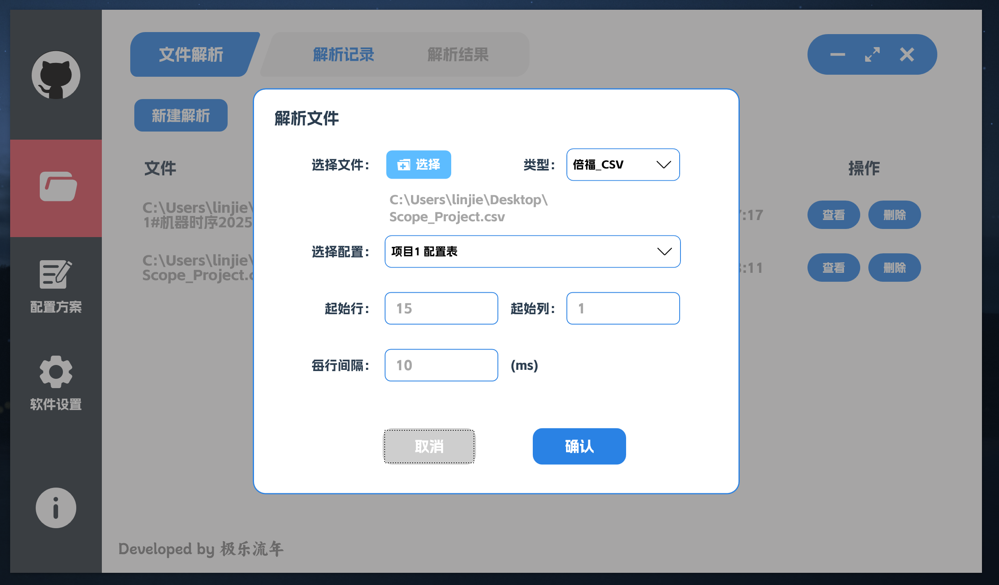
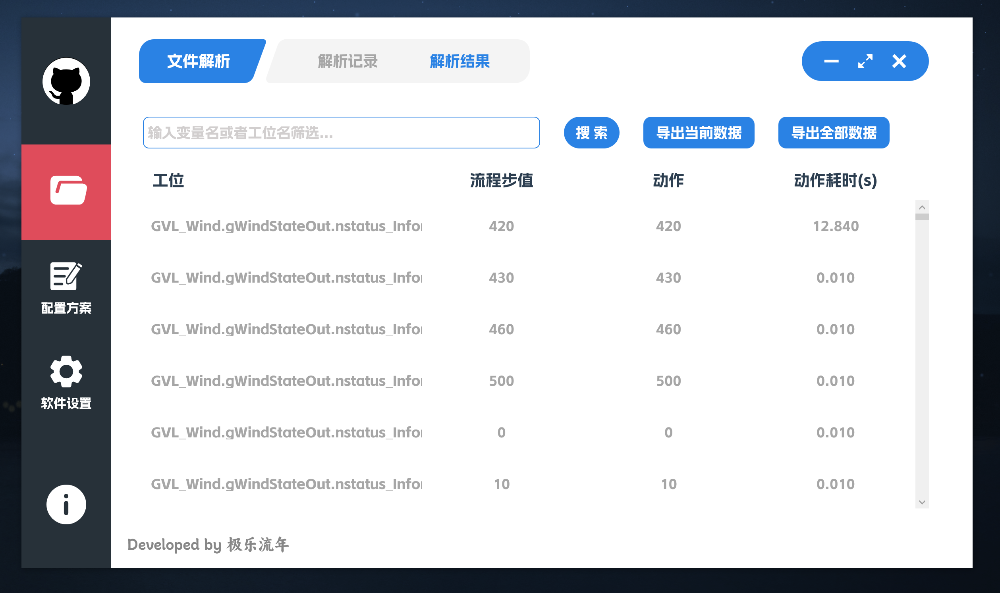
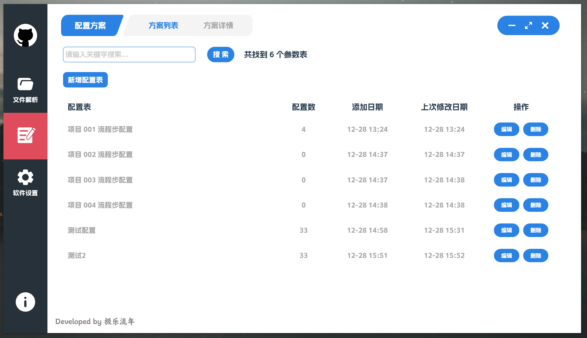
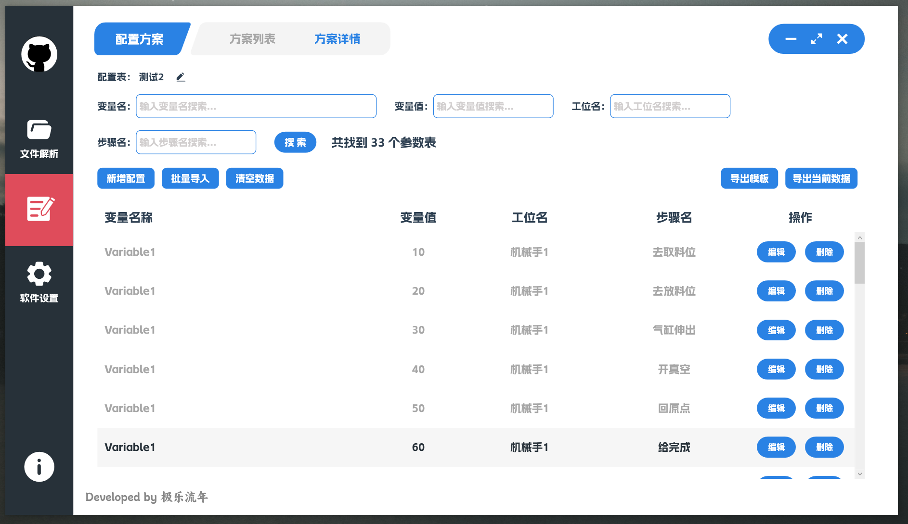

# PlcStepAnalyzer

## 项目简介：

该项目是为朋友写的一个通过解析 PLC 文件，分析设备各动作步骤耗时的一个小工具。

技术栈：WPF + Prism + Sqlite

相关工具库：SqlSugar、MiniExcel、SeriLog、Mapster

目前支持的 PLC 文件（在项目的 Doc 目录下有格式文件案例）：

		* 欧姆龙PLC CSV 格式
		* 倍福PLC CSV 格式

## 背景：

* 在 PLC 编程中，经常使用一个 [变量] + [变量值] 来代表一个动作状态，

  例如：

  * VarA 这个变量代表【机械手1】
  * 当变量值为 10  时，代表【机械手1】执行【取料】动作。
  * 当变量值为 20  时，代表【机械手1】执行【放料】动作。
  * ... 以此类推

* 一个项目，可能有非常多的动作机构，所以就会有很多状态变量

* PLC 有监控文件，可以每隔指定时间，例如 5ms，扫描一次指定变量的状态，输出到 CSV 文件。类似以下格式（不同 PLC 导出的 CSV 格式不同）

通过分析这些状态数据，就可以得出设备在运行过程中，每个步骤耗时多少，以此来做对应的动作优化。

该项目就是一个用于解析该文件，并且得出动作耗时数据的小工具。

## 软件界面

